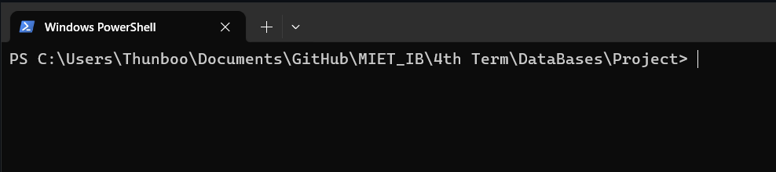
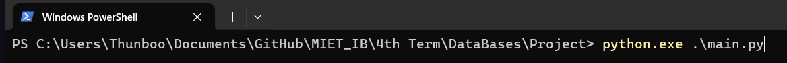
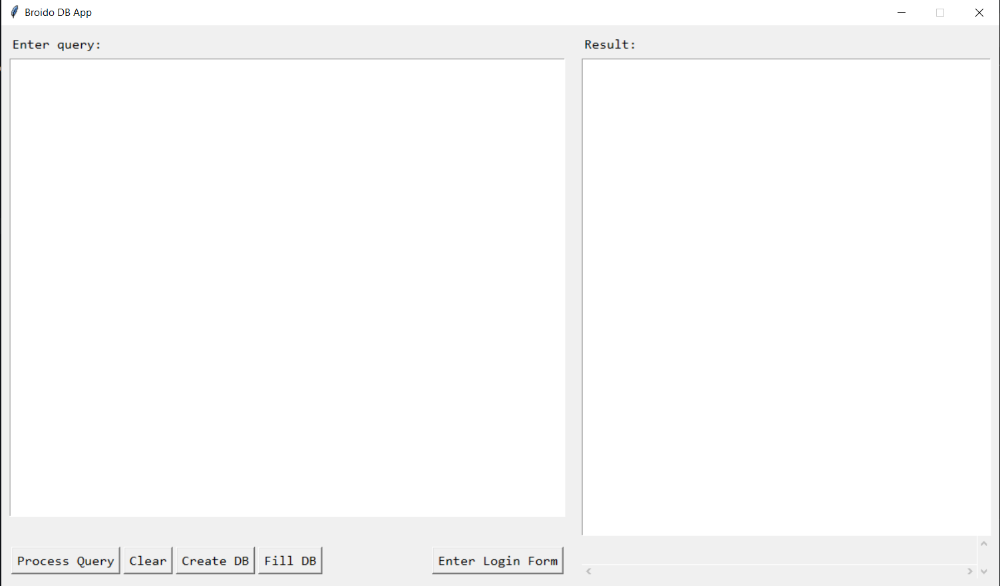
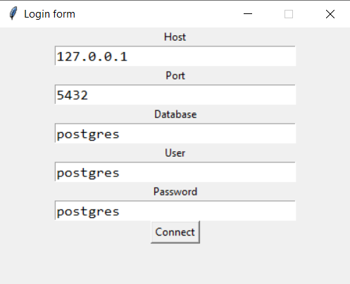
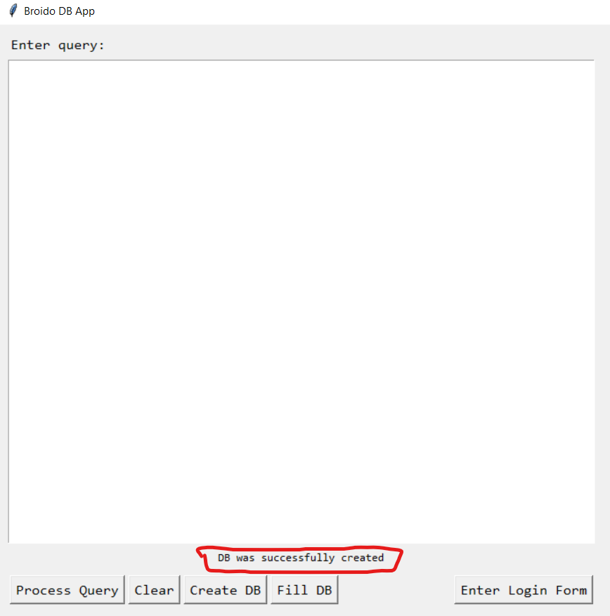
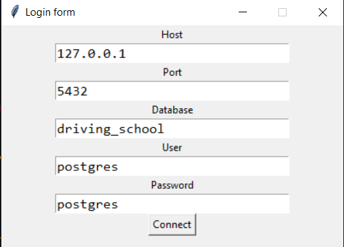
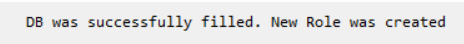

Как собрать проект

1. Запустить терминал в папке проекта (например):
    

2. Запустить сам код, предварительно убедившись в наличии следующих библиотек:
    - tkinter
    - psycopg2
    - pandas

    Для простоты можно просто ввести следующие команды в терминал: 
        `pip install tkinter` 
        `pip install psycopg2` 
        `pip install pandas` 
    
    Как запустить код: 
     
    `python.exe .\main.py`

3. Как пользоваться? (Куда жмать?)

    После запуска кода нас встречает следующий UI: 
      

    Для работы с БД - её нужно создать. Нажав на вполне логичную кнопку `Create DB` нас посетит ошибка. Даже ошибки. 
    Их мы **ВНИМАТЕЛЬНО ЧИТАЕМ** и потом переходим к следующему шагу:

    Нас интересует кнопка `Enter Login Form`. После нажатия на нее появится окно подключения. 
    Для простоты использования введем следующие данные:

     
    Нам нужен именно СУПЕРПОЛЬЗОВАТЕЛЬ!

    Теперь мы можем нажать на заветную кнопку `Create DB` и увидеть сообщение:
      

    Снова возвращаемся к кнопке `Enter Login Form`, но теперь нам нужно подключаться к новосозданной БД:
     
    Нам опять же нужен именно СУПЕРПОЛЬЗОВАТЕЛЬ!

    Теперь нажимаем на кнопку `Fill DB` и мы должны увидеть сообщение:
     
    
    Теперь мы можем подключиться к БД с новой роли `driving_school_manager` с соответствующим паролем (p.s. его можно найти в файле `role.sql`) и начать вводить запросы от имени этого пользователя.

    Для исполнения введеного в окошке запроса (левое) нажимаем на кнопку `Process Query`

    Для очищения окошка вывода (правое) нажимаем на кнопку `Clear`